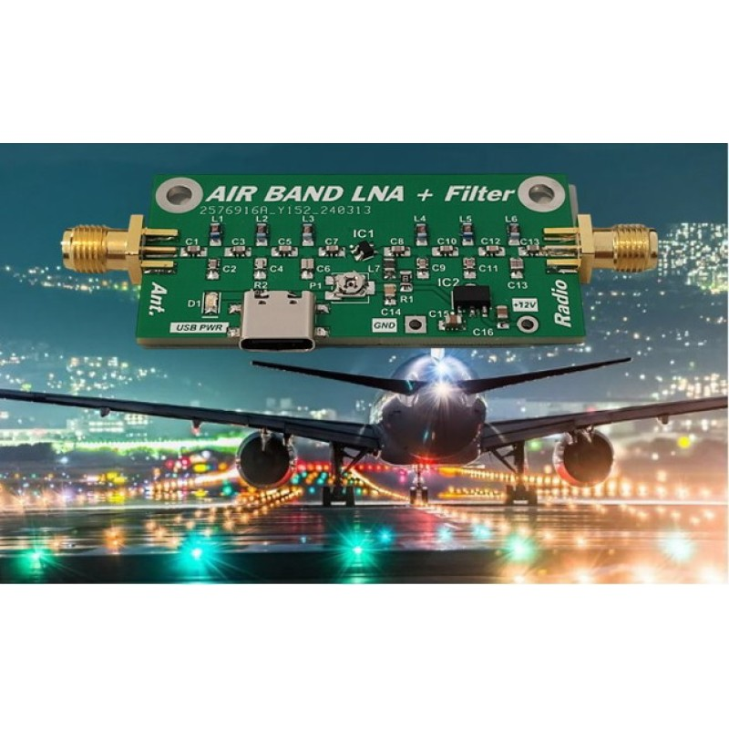
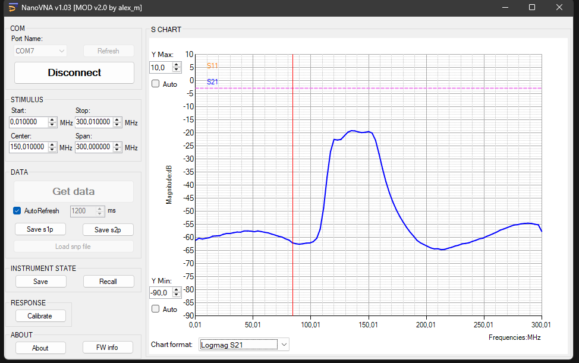
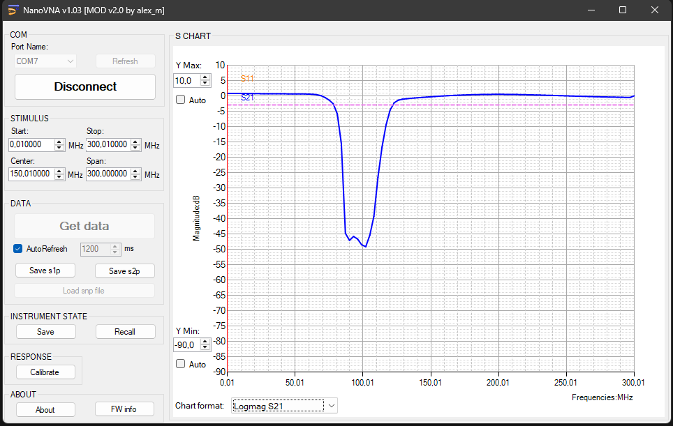
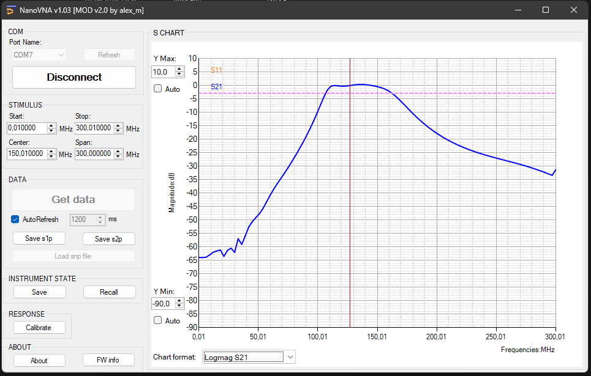
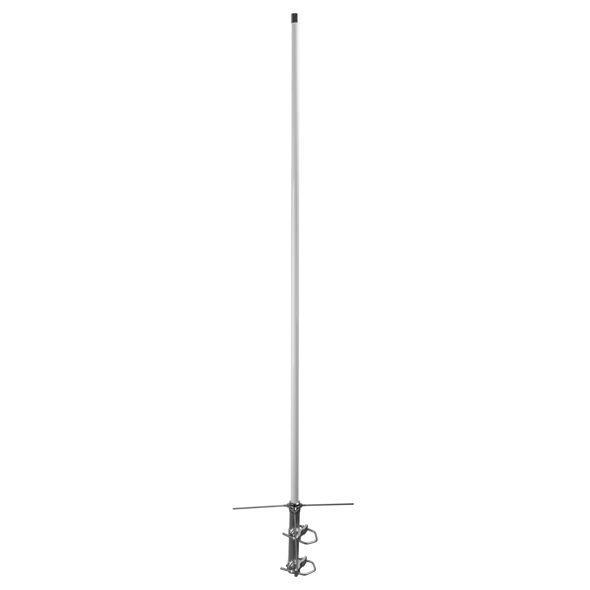

# lna-filters-results

All the measurements were done on [DeepElec NanoVNA-F](https://deepelec.com/nanovna-f/) with fw v0.2.0 and hw v2.2

## JaniLab Air band low noise amplifier

### 6th Order Modified Chebyhsev Bandpass Filter with LNA IC

Results:  

## 88-108MHz FM Broadcast Notch Filter

Link: [Aliexpress.com](https://pl.aliexpress.com/item/1005009763961279.html)

Results:  

## Band Pass Filter

Link: [Aliexpress.com](https://pl.aliexpress.com/item/1005010294986764.html)

Results:  

## RADIORA BC-100-AIR

Shortend to 1260mm

Results:

